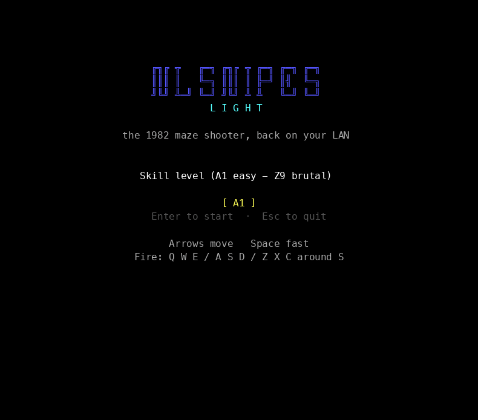

# nlSnipes



NLSNIPES Light: the 1982 text-mode maze shooter *Snipes* as one small executable.
Launch it on any machine on your LAN. If a game is already running on the subnet you join it;
otherwise you host and the game starts. Up to 4 players, everyone else spectates.

**Status:** solo and LAN play work (milestone L3). Host migration and the 1.0 release come in L4.

## Play

```sh
nlsnipes        # pick a skill code on the title screen
nlsnipes M5     # or start straight away
```

| Keys | |
| --- | --- |
| Arrows, numpad, Home / PgUp / End / PgDn | move (diagonals on numpad and Home/PgUp/End/PgDn) |
| Q W E / A S D / Z X C | fire in the direction of each key from S |
| Space | hold to run |
| F1 · V · Esc | help (pauses) · classic 40×25 view · quit |

Keys follow their position, so the fire pad works on QWERTZ and AZERTY too. Spectators: Tab
switches the player you watch.

**LAN:** start `nlsnipes` on each machine. The first one hosts (and picks the skill); the next
three join as players, everyone after that watches and takes the next free slot. Use
`--game NAME` for separate games on one network, `--host IP` when discovery can't cross your
network, `--offline` to play alone. Allow the program through the firewall on first start
(UDP ports 5108–5115).

**Best terminal:** one that reports key releases, so you stop the moment you let go:
Windows Terminal or cmd.exe on Windows; [Ghostty](https://ghostty.org), kitty, WezTerm or
iTerm2 on macOS and Linux. Others work, but a tap glides on until the keyboard's auto-repeat
would have started. The view fills the window, so make it big (in Ghostty:
`ghostty --window-width=110 --window-height=50`).


## Download

Grab the file for your system from the [latest release](https://github.com/radimlif/nlSnipes/releases/latest):
`nlsnipes-windows-amd64.exe`, `nlsnipes-darwin-arm64` (Apple silicon), `nlsnipes-darwin-amd64`
(Intel Mac) or `nlsnipes-linux-amd64`. It is one file with nothing to install. The binaries are
not code-signed: on Windows choose *More info → Run anyway*; on macOS run
`xattr -d com.apple.quarantine nlsnipes-darwin-*` and `chmod +x` it once.

## Build

```sh
git clone --recurse-submodules https://github.com/radimlif/nlSnipes.git
cd nlSnipes
go test ./...
go run ./cmd/nlsnipes
```

Requires Go 1.23 or newer.

## Documents

- [docs/DESIGN-LIGHT.md](docs/DESIGN-LIGHT.md): what is being built now
- [docs/DESIGN.md](docs/DESIGN.md): full research and long-term design; authoritative for game rules
- [CLAUDE.md](CLAUDE.md): instructions for coding agents · [docs/PROMPT.md](docs/PROMPT.md): master prompt
- [docs/decisions/](docs/decisions/): architecture decision records

## Licence

MIT, see [LICENSE](LICENSE) and [NOTICE](NOTICE). Snipes is by SuperSet Software (1982); this is an
independent re-creation containing none of its code.
